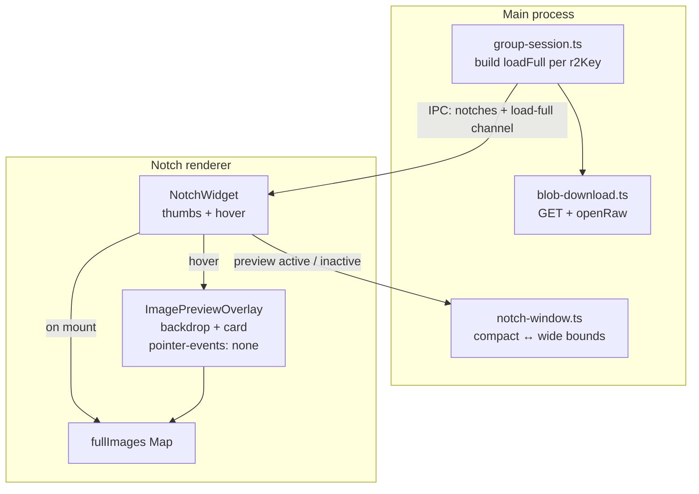

# Plan 14 — Image Quick-Look overlay (macOS parity for OQ4 / P2.3)

> **Goal:** Match upstream macOS (`limehq/munkel` `main` @ `4cec964`) image
> Quick-Look behavior on Windows Electron: while the notch is expanded, hovering
> an album thumbnail shows a near-fullscreen, screen-centered preview with a
> dimmed backdrop. Close by leaving the thumbnail / notch.
>
> **Branch:** `platform/windows/macos-parity-p1` (continues Plan 12 P2.3)
> **Depends on:** Plan 12 / Plan 13 matrix; OQ4 decided as **macOS-parity Quick-Look**
> **Status:** ✅ **Implemented (2026-07-17)** — tasks 1–8 on
> `platform/windows/macos-parity-p1` (still uncommitted as of 2026-07-18).
> User confirmed **1:1 hover parity**. `bun run typecheck` clean; `bun test`:
> 588 pass / 2 skip / 0 fail. Remaining: manual QA checklist + PR to `v2-clean`.
>
> **Upstream evidence:** snapshots in `fp-notes/macos-image-preview-upstream/`
> (extracted from `upstream/main`; key file `ImagePreviewOverlay.swift`).
> Dual-agent analysis (2026-07-17): UX interaction pass + architecture/dataflow
> pass against the extracted upstream snapshots.

---

## Decision (OQ4 closed)

**Chosen variant: macOS-parity Quick-Look overlay** — not “lightbox inside the
280px notch”, not a separate Always-on-top BrowserWindow, not the system viewer.

| Earlier OQ4 option | Verdict |
|---|---|
| A — Lightbox only inside the notch | Reject — too small; not what macOS does |
| B — Separate always-on-top window | Reject — macOS keeps one panel, expands it |
| C — System image viewer | Reject — leaves Munkel, different security surface |
| **D — Expand notch window + in-window overlay** | **Accept — mirrors upstream** |

### Critical UX correction vs. earlier plans / user “click” wording

Upstream is **hover-driven**, not click-to-open:

- `.onHover` on `AlbumCell` / `HistoryAlbumCell` → `requestPreview(id)` / `endPreview`
- First show debounced **180 ms**; sibling hand-off while open is **instant** (0.18 s cross-fade)
- Overlay is `allowsHitTesting(false)` — cannot receive clicks
- A **click** on the thumbnail area (outside the copy glyph) opens the **reply field**, not the preview

**Windows must copy the hover trigger** to stay parity-true. **Confirmed by user
2026-07-17:** build 1:1 with macOS hover (no click-to-open deviation).

---

## What macOS actually does (condensed)

### Interaction

1. Notch must be **hovered → expanded** (thumbs only exist in the expanded body).
2. Pointer enters a thumbnail → after 180 ms, large centered preview appears.
3. Move to another thumb in the same album → instant switch + short cross-fade.
4. Leave the thumb (or the whole notch) → preview clears (multiple teardown paths).
5. Opening reply / collapsing / hiding notch also clears the preview.
6. Copy glyph lives on the **thumb**, not on the large card; `C` while hovering still works.

### Visual

- Panel switches to **full screen width × full screen height** while any
  `floatingOverlay` is attached (`NotchScreenMetrics.panelFrame(wide:)`).
- Overlay is a **sibling** of the masked notch content (escapes the notch clip)
  inside the same capture-excluded panel.
- Backdrop: `Color.black.opacity(0.6)`.
- Card: fit image into available size minus gutter `max(notchHeight, 24)` on each
  side; **never upscale past native pixels** (`scale ≤ 1`); 16 pt continuous
  corners, light stroke, heavy shadow; forced dark scheme.
- Loading: spinner until `fullImages[id]` present; failure: warning glyph.

### Data flow

```
Incoming image frame
  → thumbs on NotchMessage (already done on Windows)
  → per-image loadFull(r2Key) closure (MISSING on Windows)
       BlobClient.download + MessageCrypto.openRaw(messageKey)
  → AlbumCell .task on mount → fullImages[id] cache
  → hover only toggles previewImageID (does NOT start the fetch)
  → ImagePreviewOverlay observes fullImages and paints PreviewCard
```

Fetch starts when the **cell mounts** (expanded notch / expanded history), not on hover.
Cache is RAM-only, keyed by `r2Key`, shared current+history, pruned with the 60 s history window.

---

## Windows gap today (pre-implementation) — now closed, see status header

| Piece | Status |
|---|---|
| Album send + inline thumbs in Notch | ✅ DONE |
| `uploadBlob` / `sealRaw` | ✅ DONE |
| `downloadBlob` / `openRaw` wire-up for incoming albums | ✅ DONE (`GroupSession.loadFullImage`, `AppState.loadFullImage`) |
| Per-image `loadFull` attached to notch entries | ✅ DONE (`NotchWidget.tsx` fetch-on-arrival effect → `fullImages` Map) |
| `fullImages` / `failedImages` / `previewImageID` state | ✅ DONE (`NotchWidget.tsx` state + `useImagePreview.ts`) |
| Hover → Quick-Look overlay UI | ✅ DONE (`ImagePreviewOverlay.tsx`) |
| Notch `BrowserWindow` expand to full display for overlay | ✅ DONE (`setNotchPreviewActive` in `notch-window.ts`, widens to `workArea`) |
| Image copy from full-res (matrix PARTIAL) | ✅ DONE (`copy-image-to-clipboard.ts`, matrix row now DONE) |

---

## Architecture on Windows (native Electron)

Mirror macOS’s **one window, widen canvas, overlay sibling** — do **not** spawn a
second BrowserWindow (avoids focus, capture-protection, and click-through splits).



### Geometry strategy

| Mode | Window bounds | Content |
|---|---|---|
| Compact (default) | Top-center, `NOTCH_WIDTH=280`, content height | Existing notch UI only |
| Wide (preview active) | Full **display** width × height (or workArea — decide in impl; prefer matching macOS `screen.frame`) | Notch UI stays top-center; overlay fills canvas; `pointer-events: none` on overlay |

Implementation sketch:

- `setNotchPreviewMode(win, active: boolean)` in `notch-window.ts`
- On `active=true`: remember compact bounds, `setBounds` to display frame, keep
  `setContentProtection(true)`, `alwaysOnTop`, `focusable: false`
- On `active=false`: restore compact bounds / content-driven height
- Renderer reports preview on/off via guarded IPC (`notch-set-preview-active`)
- Overlay CSS: fixed fullscreen within the window, z-index above notch body,
  `pointer-events: none` so hover still hits the thumbs underneath…  
  **Caveat:** once the window is full-screen, hit-testing the small top-center
  thumbs requires either (a) keeping thumbs hit-targetable above the
  non-interactive backdrop only in the notch strip, or (b) routing hover via
  the notch widget region while the backdrop ignores events. macOS solves this
  by making the overlay non-hit-testable over the full canvas while the notch
  body remains interactive. Replicate that: backdrop+card `pointer-events: none`;
  notch chrome remains interactive.

### Data / IPC

1. **`src/core/blob-download.ts`** (new) — mirror `blob-upload.ts`:
   - `downloadBlob(relayUrl, groupId, r2Key, maxBytes, fetchImpl?)`
   - Reuse `blobBaseUrl`
   - Cap = server blob cap + envelope (align with macOS
     `3 * 1024 * 1024 + 4096` / shared-wire constants if present)

2. **`group-session.ts`** — on incoming `kind === 'image'`, build
   `loadFull(r2Key) => downloadBlob + openRaw(messageKey)` and expose it to the
   notch path (same pattern as macOS `onImages(..., loadFull)`).

3. **IPC** (prefer main-owned download; renderer never sees `messageKey`):
   - `notch-load-full-image({ group, r2Key }) → { ok, bytesBase64? } | { ok:false }`
   - Sender-guarded to notch window only
   - Or: preload a per-message token map in main and invoke by `r2Key` only

4. **Renderer state** (in `NotchWidget` or small hook `useImagePreview`):
   - `fullImages: Map<string, Uint8Array | string>`
   - `failedImages: Set<string>`
   - `previewImageID: string | null`
   - `requestPreview` / `endPreview` / `clearPreview` with 180 ms debounce semantics
   - On thumb mount: kick `load-full`; cache shared with history rows

5. **UI** — new `ImagePreviewOverlay.tsx` + CSS:
   - Backdrop `rgba(0,0,0,0.6)`
   - Card: object-fit contain, gutter `max(notchHeight, 24)`, no upscale past natural
     size (use `width`/`height` from `IncomingImage`), radius 16, stroke, shadow
   - Transitions: opacity + scale 0.92 (respect `prefers-reduced-motion`)
   - Spinner / fail glyph parity

6. **Copy PARTIAL** — once `fullImages` exists, extend copy path to prefer full-res
   bytes (clipboard PNG via existing clipboard helpers), else thumb — closes the
   matrix PARTIAL for “Notch copy message”.

### Out of scope

- Animated GIF/`isAnimated` path (upstream special-cases `AnimatedImageView`) —
  ship still AVIF first; note as follow-up if Windows albums ever carry GIF.
- Separate BrowserWindow lightbox, system viewer, click-to-open modal.
- OQ5 CLI installer.
- Persisting full-res to disk.

---

## Tasks (implementation order)

| # | Task | Files | Est. | Verify |
|---|---|---|---|---|
| 1 | Add `blob-download.ts` + unit tests (happy path, oversize, 404, decrypt fail) | `src/core/blob-download.ts`, `__tests__` | S | ✅ **DONE** (pre-existing) |
| 2 | Wire `loadFull` in `group-session` + notch IPC (sender-guarded) | `group-session.ts`, `session-store.ts`, `main.ts`, `ipc-channels.ts`, `preload.ts`, `types.ts` | M | ✅ **DONE** — unit tests (`group-session.test.ts`, `session-store.test.ts`) + typecheck |
| 3 | Renderer cache + mount-time fetch for thumbs (current + history) | `NotchWidget.tsx` | M | ✅ **DONE** — covered by `NotchWidget.test.tsx` |
| 4 | Hover preview state machine (180 ms / instant hand-off / clear paths) | `image-preview-state.ts`, `useImagePreview.ts` | S | ✅ **DONE** — `image-preview-state.test.ts`, `useImagePreview.test.ts` (debounce, hand-off, owner-checks, unmount) |
| 5 | `ImagePreviewOverlay` UI + CSS | `ImagePreviewOverlay.tsx`, `global.css` | M | ✅ **DONE** — reduced-motion rules extended; visual QA still pending (see checklist) |
| 6 | Notch window wide/compact mode | `notch-window.ts`, IPC, tests | M | ✅ **DONE** — `notch-window.test.ts` (`setNotchPreviewActive` suite), no-oscillation guard verified |
| 7 | Image copy prefers full-res | `useNotchLifecycle.ts`, `copy-image-to-clipboard.ts` | S | ✅ **DONE** — `copy-image-to-clipboard.test.ts`; manual QA still pending |
| 8 | Docs / matrix reconcile | Plan 12 matrix, Plan 14 status, STATE.md | S | ✅ **DONE** — matrix → P2.3 DONE (this edit) |

**Process (project convention):** Kimi plan-verify → Sonnet implement+tests → Kimi adversarial review → fix → re-review SHIP. No speculative second window.

---

## Manual QA checklist

- [ ] Receive album (1 image and 3+ images); expand notch; hover thumb → near-fullscreen centered card + dim backdrop after ~180 ms
- [ ] Sweep across album thumbs → instant switches, no flash-blank
- [ ] Leave thumb / leave notch → preview gone; window returns to compact 280 px
- [ ] Hover history thumbs (history expanded) → same overlay
- [ ] Open reply while preview up → preview clears
- [ ] Copy glyph / `C` while hovering → full-res when loaded, else thumb
- [ ] Packaged build: overlay still content-protected (not visible in Snipping Tool / share)
- [ ] Display scaling 100 / 125 / 150 %: no bounds flicker

---

## Risks / open impl details (non-blocking for kickoff)

1. **Hit-testing after widen:** must keep thumbs interactive under a full-canvas
   non-interactive overlay (see Geometry strategy).
2. **`screen.frame` vs `workArea`:** macOS uses full `screen.frame` (under menu bar).
   On Windows, taskbar suggests `workArea` may be better — decide in task 6 with a
   one-line rationale in code.
3. **AVIF decode in overlay:** thumbs already use ``;
   full-res can use the same once bytes are base64’d — verify Chromium AVIF for
   large payloads; fallback path if decode fails → fail glyph.
4. **Memory:** prune `fullImages` with history window (mirror macOS 1 Hz prune) so
   long sessions don’t retain every album forever.

---

## Matrix outcome (achieved)

P2.3 **DONE**, Notch copy message **DONE** (was PARTIAL), OQ4 closed. Plan 12's
matrix now reads **38 DONE / 1 PARTIAL (About panel only) / 0 MISSING / 1
BLOCKED (P2.2/OQ5, CLI installer)**.
